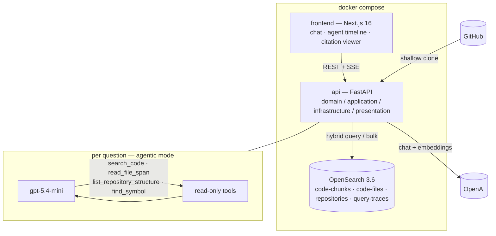

# Codedoc — Code Documentation Assistant

Paste a public GitHub repository URL; ask questions about the code; get answers
with `file:line` citations you can open and read. An agentic RAG system over an
OpenSearch hybrid index, built for the Newpage AI FDE assignment (Option 2).

## Quick start

Prereqs: Docker (compose v2), an OpenAI API key.

```bash
export CODEDOC_OPENAI_API_KEY=sk-…   # or: cp .env.example .env and fill it in
docker compose up --build
# frontend http://localhost:3000 · api http://localhost:8000 · opensearch http://localhost:9200
```

(`backend/.env.example` and `frontend/.env.example` cover running either service
outside docker.)

Optional: `docker compose --profile debug up -d dashboards` → OpenSearch Dashboards
on http://localhost:5601 (browse the `query-traces` index).

## Architecture



Ingestion: clone (shallow, size/time-capped) → scan → **tree-sitter AST chunking**
(one chunk per function/class, exact line spans) → embed (`text-embedding-3-large`,
batched) → bulk index. Answering: a LangGraph tool-loop agent (or a single-shot
pipeline — switchable in the UI) retrieves via **hybrid search** (BM25 + k-NN,
fused by OpenSearch's normalization processor), then answers with `[cite:]` tokens
that are **validated against the evidence actually retrieved** — ungroundable
answers say so.

## RAG / LLM decisions

| decision | options considered | choice | why |
|---|---|---|---|
| Chunking | fixed windows, AST | **tree-sitter AST** | whole symbols with exact line spans → citable, self-contained; windows cut functions in half |
| Embeddings | 3-small, 3-large, code-specialists | **text-embedding-3-large** | at demo scale the cost delta is cents — take the recall headroom; specialists are one adapter away, `--embedding-model` compares |
| LLM | gpt-5.4 / -mini / -nano | **gpt-5.4-mini** | OpenAI positions it for coding/sub-agent tool use; 6–7× cheaper than gpt-5.4 |
| Vector store | pgvector, Chroma, OpenSearch | **OpenSearch (lucene engine)** | real BM25 + k-NN + filters in one engine; faiss mutates stored cosine vectors, lucene doesn't |
| Fusion | client-side RRF, native pipeline | **normalization-processor** | weighted min-max is a tuning knob RRF lacks; one round trip |
| Orchestration | LangGraph, hand-rolled loop | **LangGraph** | explicit graph, budget via recursion_limit, native streaming modes |
| Retrieval shape | single-shot RAG, agent | **agent + single-shot toggle** | code questions are heterogeneous; the eval report compares the two head-to-head |
| Guardrails | detection, containment | **containment first** | tools are read-only; evidence is wrapped as data; citations validated; scope guard pre-filters |
| Prompts | inline strings, versioned files | **versioned prompt files** | one system prompt per answering mode, loaded from `backend/src/codedoc/prompts/` — reviewable, diffable, and the citation/evidence contract lives in one place |

## Evals

`make eval` ingests the golden repo and runs 25 questions (symbol lookups,
multi-hop, endpoints, dependencies, adversarial probes) in both modes — agentic
vs single-shot head-to-head — judging faithfulness/correctness with an LLM judge
against a written rubric (`backend/src/codedoc/evals/judge_rubric.md`). The
report lands in `backend/evals/reports/` and is committed after each run.

## Productionizing on AWS

- **Compute**: the two containers → ECS Fargate services behind an ALB; frontend
  could move to Vercel/CloudFront+S3 unchanged.
- **Search**: single-node OpenSearch → Amazon OpenSearch Service (3 data nodes,
  dedicated masters, zone awareness); k-NN graphs need memory headroom — size off
  ~13.7 KB/vector and shard by repository volume.
- **Ingestion**: in-process task → SQS queue + a worker service; idempotent
  delete-then-write re-ingest already supports retries.
- **Secrets**: env vars → Secrets Manager (OpenAI key rotation without redeploys).
- **Edge**: WAF + per-IP rate limiting on the ALB; auth (Cognito/OIDC) before
  multi-tenant use; per-user token budgets.
- **Observability**: structlog JSON → CloudWatch; query traces stay in OpenSearch;
  OTel + Prometheus/Grafana for latency/cost SLOs; LangSmith flag for deep LLM traces.
- **CI/CD**: GitHub Actions OIDC → ECR push → ECS rolling deploy.
- **Cost reality**: managed OpenSearch dominates the bill; embeddings are
  pennies-per-repo at this scale; chat cost is bounded by the tool budget and
  the cost meter is visible per answer in the UI.

## Engineering standards

Followed: TDD throughout (unit suites on fakes, integration suite on real
OpenSearch, Playwright smoke); clean architecture with Protocol ports; strict
mypy + ruff; structured JSON logs with request ids; containerized; CI gates lint,
types, both test suites, and the compose build.

Consciously skipped (documented trade-offs): no auth / multi-tenancy; no rate
limiting locally; chat history is client-side; single-node OpenSearch; evals not
in the CI gate (cost, non-determinism); no incremental re-indexing (re-ingest is
idempotent instead).

<!-- AUTHOR-WRITTEN SECTION: to be written by the human author per assignment rules — do not generate -->
## How I used AI tools

<!-- AUTHOR-WRITTEN SECTION: to be written by the human author per assignment rules — do not generate -->
## What I'd do differently

## Screenshots

(see docs/screenshots-checklist.md — embedded here before submission)
